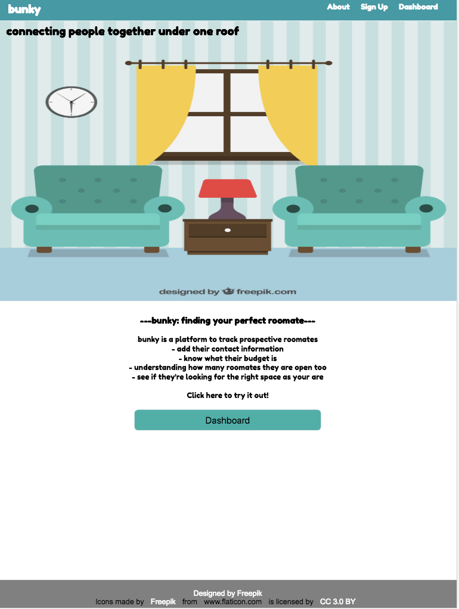
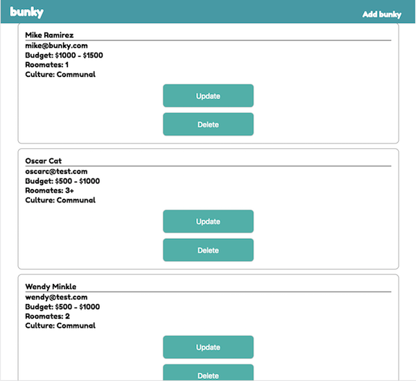
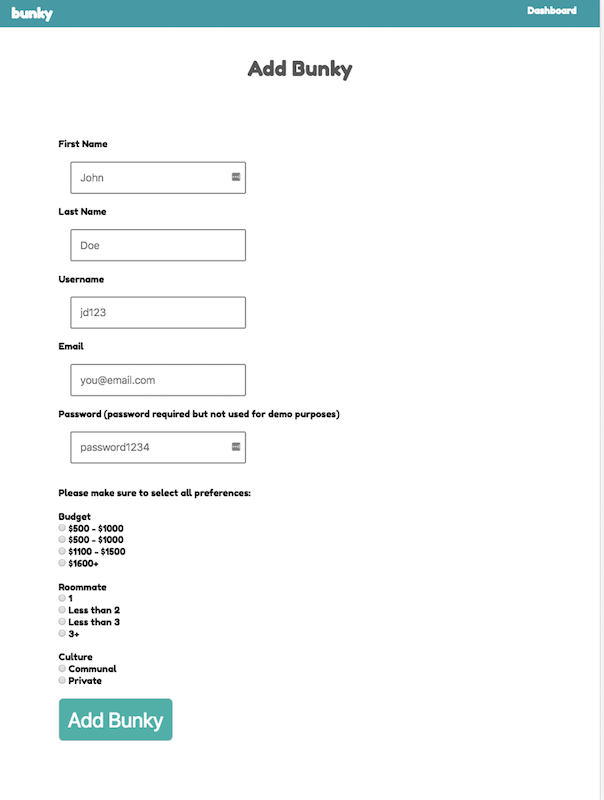
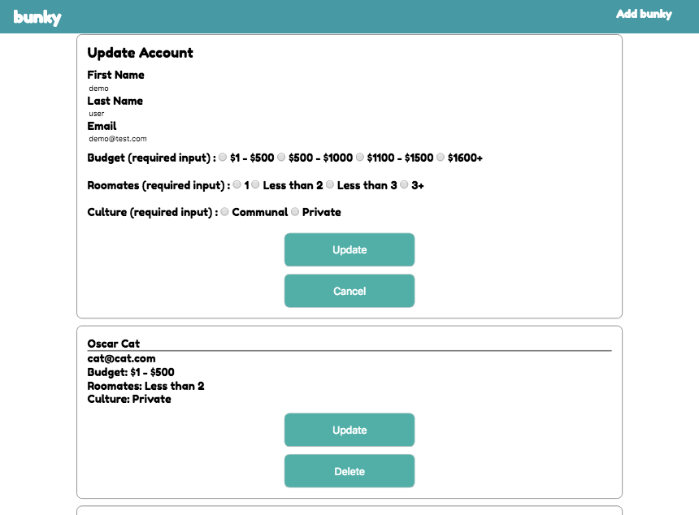

# bunky
<h1>Node Capstone: bunky</h1>

Live Link: <a href="https://mikeramz86.github.io/morning_design_ritual_api/"> bunky </a>

<h2>Images</h2>

Home Page 

Dashboard Page (get/delete/update)

Add bunky (Post Endpoint) 

Update Page (Put bunky)

<h2>Summary</h2>

In today's world more and more people are choosing to live with roomates due to the high cost of living in places. The problem is that sometimes it's a hassle finding a roomate, expecially finding the right one.

 bunky is an app to track prospective roomates.  bunky: 

<strong>Add prospective roomates</strong>: Track their contact info, their budget, how many roomates they want, and their culture fit 

 <strong>Update</strong>: Along the way prospects can change their status. bunky allows you to update information 

 <strong>Not a fit for me</strong>: bunky allows you to delete prospects that don't meet the criterium you are are looking for

Note: this current app is a demo on how the app will work. More features will be added soon.

<h2> How to Use it</h2>

 Click on Dashboard to see already demo prospects 

 Click on add bunky to add a new prospect

 Click Update to change any of the inputs

 Click Delete to not see a prospect anymore

<h2> Technology Used</h2>
<h3>Front End</h3>
<li> HTML5 </li>
<li> CSS3 </li>
<li>jQuery</li>
<li>Javascript</li>

<h3>Back End</h3>
<li>Node.js</li>
<li>Express.js</li>
<li>MongoDB</li>
<li>Mongoose</li>
<li>mLab database</li>
<li>Mocha and Chai for testing</li>

<h2>Responsive</h2>

This app is built to be focused on mobile first design and is able to function in different view ports

<h2>Next Version/Updates</h2>
<li>Creating Individual users with authentication</li>
<li>ability to see other people looking for roomates</li>
<li>ability to add notes for each prospect</li>
<li>ability to message prospects with in the app</li>
<li>ability to add more filters and search through filters</li>
<li>styling errors</li>
<li>filter for specific locations</li>
<li>end result to hopefully connect this to apartment/housing listings</li>

