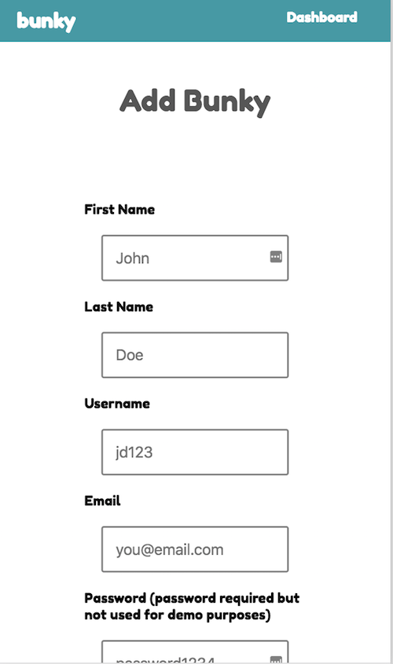
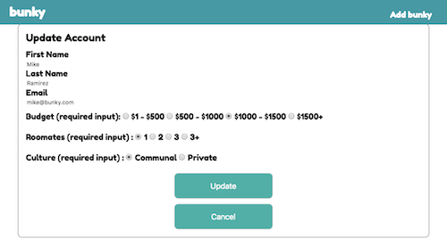

# bunky
<h1>Node Capstone: bunky</h1>

Live Link: <a href="https://murmuring-castle-28514.herokuapp.com/index.html"> bunky </a>

<h2>Images</h2>

Home Page 

Dashboard Page (get/delete/update)

Add bunky (Post Endpoint) 

Update Page (Put bunky)

<h2>Summary</h2>

In today's world more and more people are choosing to live with roommates due to the high cost of living in many places. Sometimes it can be a hassle finding a roommate, especially the right one.

 bunky is an app to track prospective roommates.  bunky: 

<strong>Add prospective roommates</strong>: Track their contact info, their budget, how many roommates they want, and their culture fit 

 <strong>Update</strong>: Along the way prospects can change their status. bunky allows you to update information. 

 <strong>Not a fit for me</strong>: bunky allows you to delete prospects that don't meet the criteria you are are looking for.

Note: This current app is a demo for how the app will work. More features will be added soon.

<h2> How to Use it</h2>

 Click on 'Dashboard' to see demo prospects 

 Click on 'add bunky' to add a new prospect

 Click 'Update' to change any of the inputs

 Click 'Delete' to not see a prospect anymore

<h2> Technology Used</h2>
<h3>Front End</h3>
<li> HTML5 </li>
<li> CSS3 </li>
<li>jQuery</li>
<li>Javascript</li>

<h3>Back End</h3>
<li>Node.js</li>
<li>Express.js</li>
<li>MongoDB</li>
<li>Mongoose</li>
<li>mLab database</li>
<li>Mocha and Chai for testing</li>

<h2>Responsive</h2>

This app is built to be focused on mobile first design and is able to function in different view ports

<h2>Next Version/Updates</h2>
<li>Creating individual users with authentication</li>
<li>Ability to see other people looking for roommates</li>
<li>Ability to add notes for each prospect</li>
<li>Ability to message prospects within the app</li>
<li>Ability to add and search through filters</li>
<li>Styling errors</li>
<li>Filter for specific locations</li>
<li>End result to hopefully connect this to apartment/housing listings</li>

